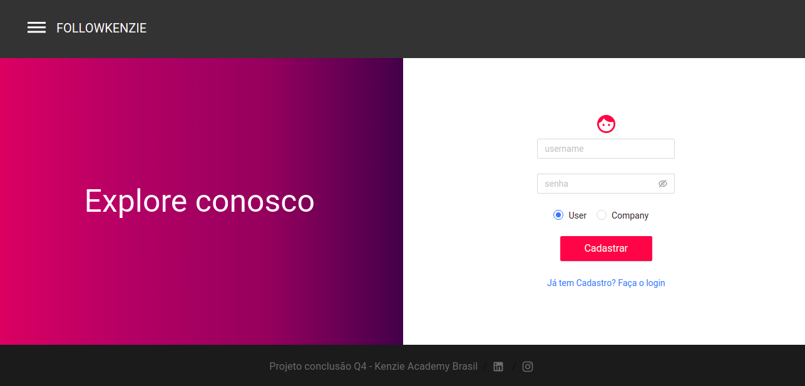
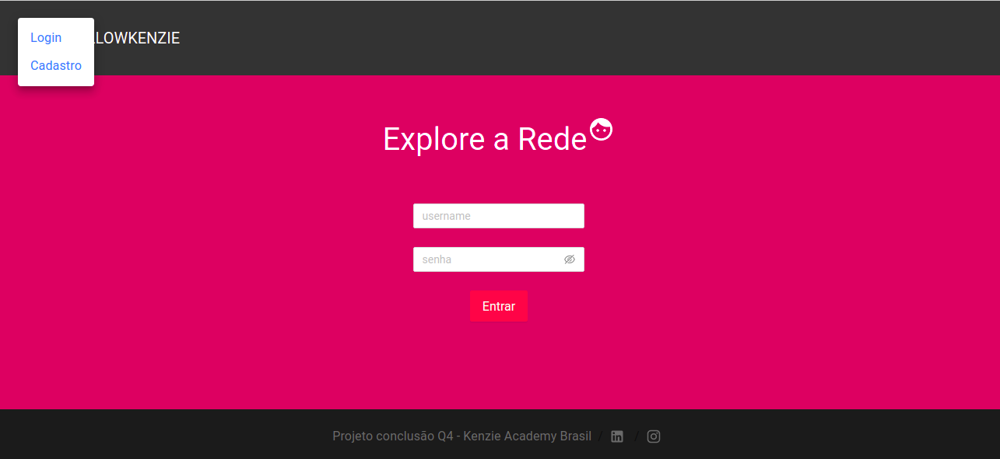
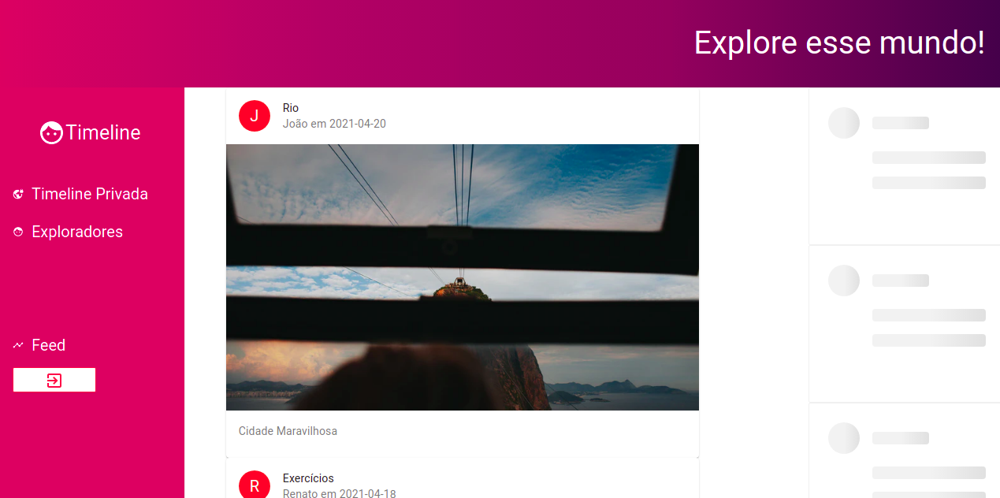
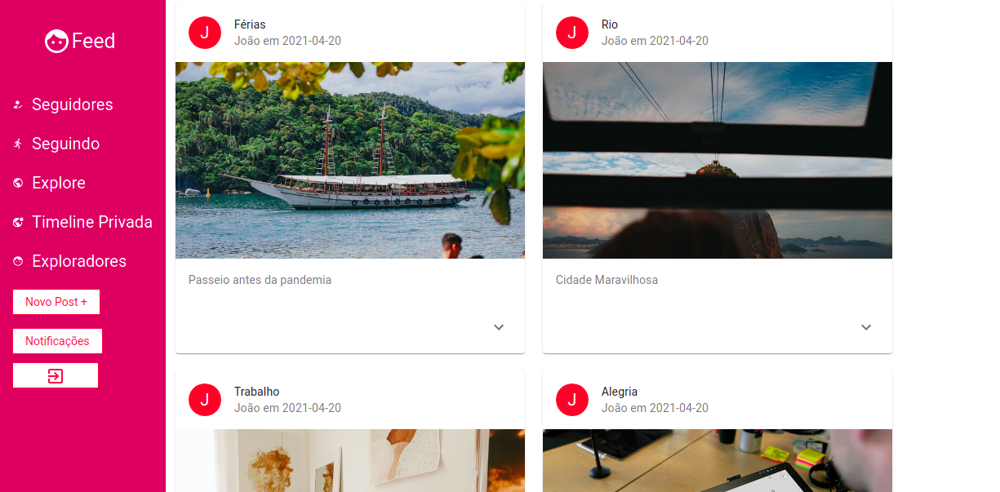
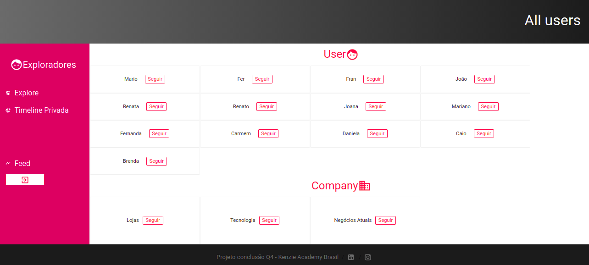
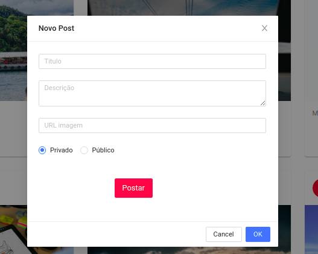
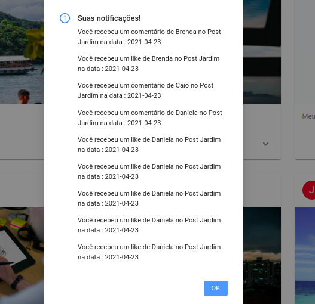

# FollowKenzie

### Setup requirements

Nodejs: latest version

## Available Scripts

In the project directory, you can run:

### `yarn install`

It installs all the dependencies for the project

### `yarn start`

Runs the app in the development mode.\
Open [http://localhost:3000]

## Author:

Francielle de Abreu da Silva
